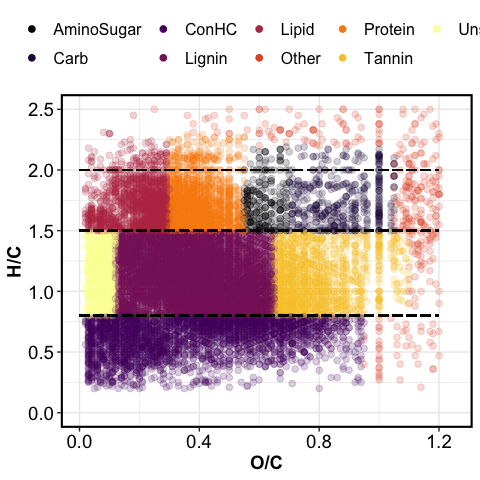
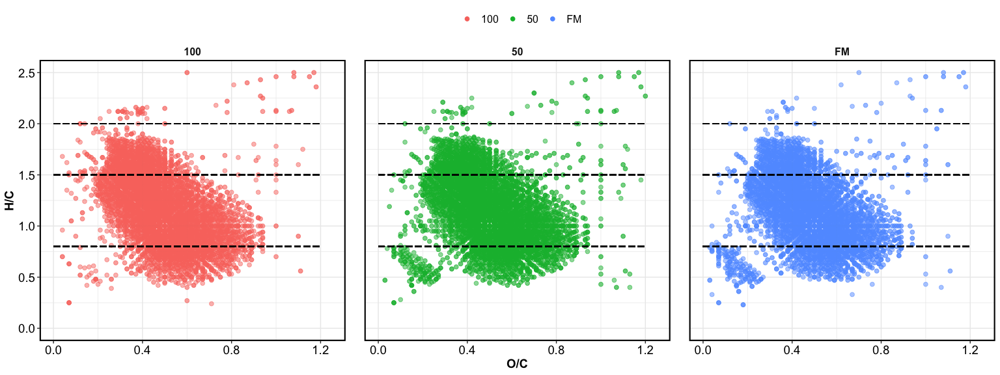

fticr\_markdown
================

## VAN KREVELEN DOMAINS

<!-- -->

## VAN KREVELEN PLOTS

### simple VK plots

<!-- -->

### VK plots with marginal plots

<!-- -->

## RELATIVE ABUNDANCE FIGURES

<!-- -->

## RELATIVE ABUNDANCE TABLES
