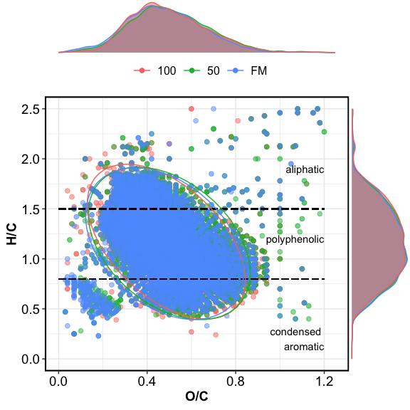

fticr\_markdown
================

## VAN KREVELEN DOMAINS

<!-- -->

## VAN KREVELEN PLOTS

### simple VK plots

<!-- -->

### VK plots with marginal plots

<!-- -->

## RELATIVE ABUNDANCE FIGURES

<!-- -->

## RELATIVE ABUNDANCE TABLES

Different letters denote significant differences among saturation levels
at alpha = 0.05.

|   Class    |       100       |       50       |       FM       |
| :--------: | :-------------: | :------------: | :------------: |
| AminoSugar |  0.71 ± 0.11 b  | 1.15 ± 0.07 a  | 0.83 ± 0.07 b  |
|    Carb    |  0.35 ± 0.06 b  | 0.72 ± 0.04 a  |  0.7 ± 0.06 a  |
|   Lipid    |  4.75 ± 1.28 a  | 2.85 ± 0.06 a  | 3.37 ± 0.07 a  |
|  Protein   | 15.93 ± 2.87 a  | 13.27 ± 0.18 a | 12.99 ± 0.13 a |
|  UnsatHC   |  0.25 ± 0.08 a  | 0.23 ± 0.03 a  | 0.29 ± 0.04 a  |
|   ConHC    | 14.12 ± 2.56 a  | 16.77 ± 0.2 a  | 17.48 ± 0.18 a |
|   Lignin   | 52.39 ± 1.06 ab | 50.64 ± 0.3 b  | 53.09 ± 0.1 a  |
|   Tannin   | 10.85 ± 2.65 a  | 13.51 ± 0.19 a | 10.69 ± 0.09 a |
|   Other    | 0.65 ± 0.11 ab  | 0.84 ± 0.03 a  | 0.56 ± 0.03 b  |
