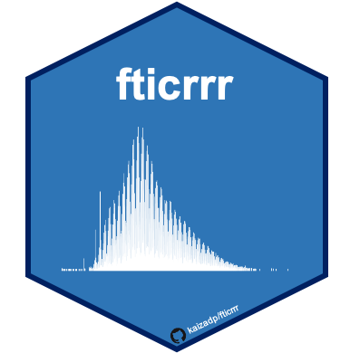

# fticrrr

This script is designed for batch processing and analysis of **FTICR
r**esults in **R** (fticrrr).

Use this script for:  
(a) cleaning and processing data  
(b) plotting Van Krevelen diagrams  
(c) calculating relative abundance of functional classes  
(d) statistical analyses

-----

