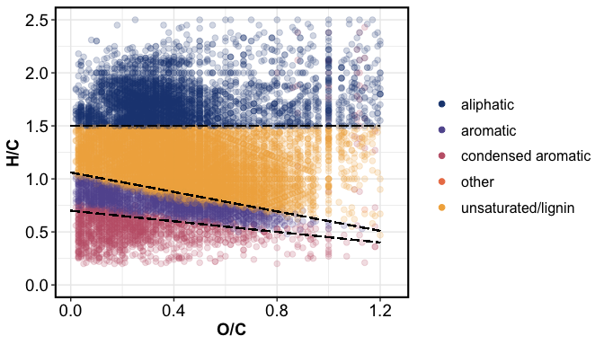
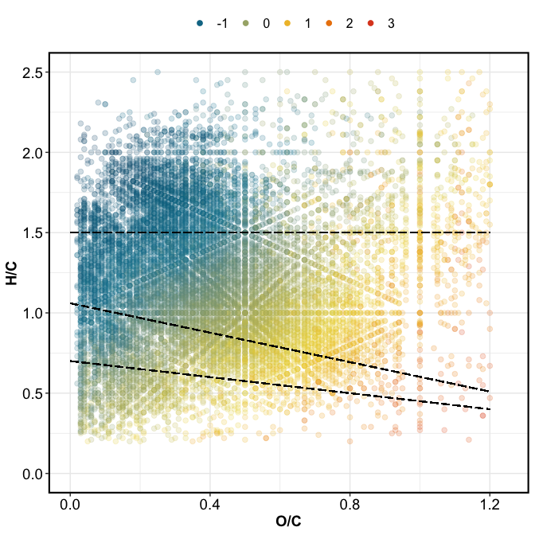
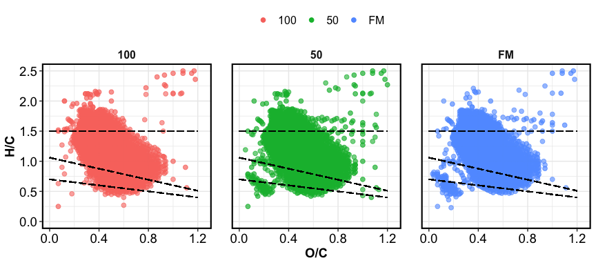
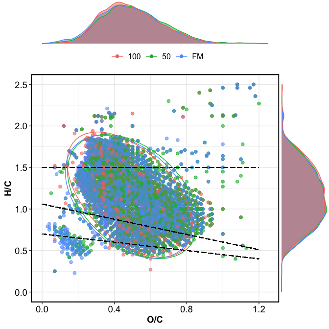
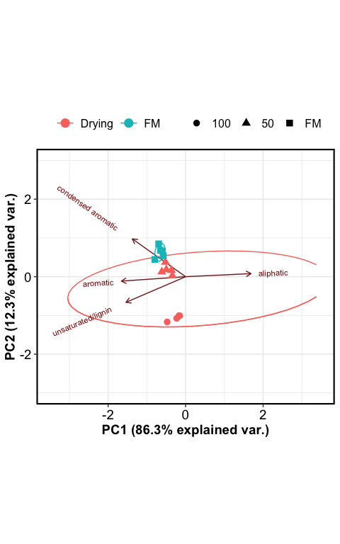
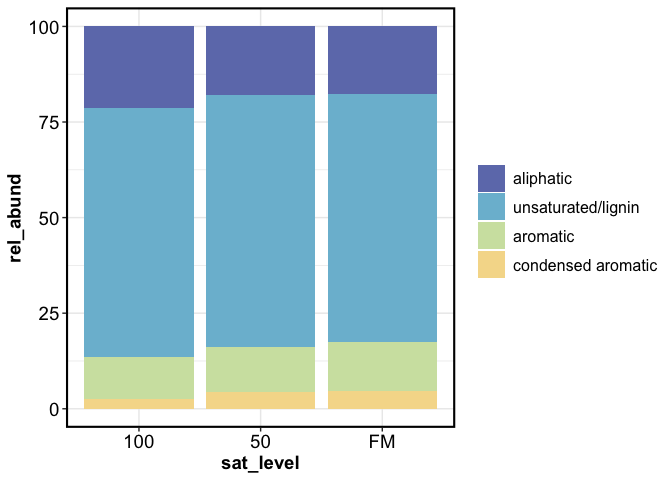

fticrrr report
================

-----

## FTICR domains

### compound classes

``` r
readd(gg_vankrevelens)$gg_vk_domains+theme(legend.position = "right")
```

<!-- -->

### NOSC

``` r
readd(gg_vankrevelens)$gg_vk_domains_nosc
```

<!-- -->

-----

## Van Krevelen plots

option 1

``` r
readd(gg_vankrevelens)$gg_vk1
```

<!-- -->

option 2, with marginal plots

``` r
readd(gg_vankrevelens)$gg_vk2
```

<!-- -->

-----

## PCA

``` r
readd(gg_pca)+theme_kp()+xlim(-3.5,3.5)+ylim(-3,3)
```

<!-- -->

-----

## Relative abundance

``` r
readd(gg_relabund_bar)+theme(legend.position = "right")
```

<!-- -->
